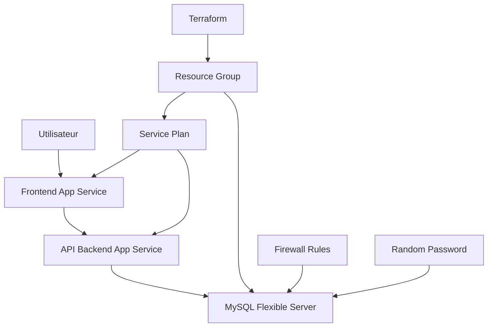

# Déploiement d'une Stack Web Complète sur Azure avec Terraform

[](https://terraform.io)
[](https://azure.microsoft.com)
[](https://php.net)
[](https://mysql.com)

> **Projet d'Infrastructure as Code (IaC)**
> Déploiement automatisé d'une application web full-stack sur Microsoft Azure

## Table des Matières

- [Vue d'ensemble](#vue-densemble)
- [Architecture](#architecture)
- [Prérequis](#-prérequis)
- [Configuration pour un nouveau compte Azure](#configuration-pour-un-nouveau-compte-azure)
- [Structure du projet](#structure-du-projet)
- [Déploiement étape par étape](#déploiement-étape-par-étape)
- [Gestion des Archives ZIP](#gestion-des-archives-zip)
- [Initialisation de la base de données](#initialisation-de-la-base-de-données)
- [Variables et configuration](#variables-et-configuration)
- [Sécurité](#sécurité)
- [Surveillance et logs](#surveillance-et-logs)
- [Dépannage](#dépannage)
- [Nettoyage des ressources](#-nettoyage-des-ressources)

## Vue d'ensemble

Ce projet déploie une stack web complète comprenant :

- **Frontend** : Application web statique (HTML/CSS/JavaScript)
- **Backend** : API REST en PHP avec gestion CORS
- **Base de données** : MySQL Azure Flexible Server
- **Infrastructure** : Azure App Services avec SSL/TLS

### Fonctionnalités

-Déploiement Infrastructure as Code (IaC) avec Terraform  
-Génération automatique des mots de passe sécurisés  
-Configuration SSL pour MySQL Azure  
-Gestion CORS pour les requêtes cross-origin  
-Déploiement automatique via Azure CLI  
-Variables d'environnement sécurisées  

## Architecture



### Composants déployés

| Composant | Type Azure | SKU | Coût estimé/mois |
|-----------|------------|-----|------------------|
| Resource Group | `azurerm_resource_group` | - | Gratuit |
| Service Plan | `azurerm_service_plan` | S1 Standard | ~15€ |
| Frontend App | `azurerm_linux_web_app` | - | Inclus dans Service Plan |
| Backend App | `azurerm_linux_web_app` | - | Inclus dans Service Plan |
| MySQL Server | `azurerm_mysql_flexible_server` | B_Standard_B1ms | ~8€ |
| **Total** | | | **~23€/mois** |

## 🔧 Prérequis

### Outils requis

```bash
# Terraform
terraform --version  # >= 1.0

# Azure CLI
az --version  # >= 2.0

# Utilitaires système
zip --version
curl --version
```

### Installation des outils

<details>
<summary>Linux (Ubuntu/Debian)</summary>

```bash
# Terraform
wget -O- https://apt.releases.hashicorp.com/gpg | sudo gpg --dearmor -o /usr/share/keyrings/hashicorp-archive-keyring.gpg
echo "deb [signed-by=/usr/share/keyrings/hashicorp-archive-keyring.gpg] https://apt.releases.hashicorp.com $(lsb_release -cs) main" | sudo tee /etc/apt/sources.list.d/hashicorp.list
sudo apt update && sudo apt install terraform

# Azure CLI
curl -sL https://aka.ms/InstallAzureCLIDeb | sudo bash
```
</details>

<details>
<summary>macOS</summary>

```bash
# Terraform
brew tap hashicorp/tap
brew install hashicorp/tap/terraform

# Azure CLI
brew install azure-cli
```
</details>

<details>
<summary>Windows</summary>

```powershell
# Terraform (via Chocolatey)
choco install terraform

# Azure CLI
Invoke-WebRequest -Uri https://aka.ms/installazurecliwindows -OutFile .\AzureCLI.msi
Start-Process msiexec.exe -Wait -ArgumentList '/I AzureCLI.msi /quiet'
```
</details>

## Configuration pour un nouveau compte Azure

### 1. Création d'un Service Principal

```bash
# Connexion à Azure
az login

# Lister les souscriptions disponibles
az account list --output table

# Sélectionner la bonne souscription
az account set --subscription "YOUR_SUBSCRIPTION_ID"

# Créer un Service Principal
az ad sp create-for-rbac --name "terraform-sp" --role="Contributor" --scopes="/subscriptions/YOUR_SUBSCRIPTION_ID"
```

**Sortie attendue :**
```json
{
  "appId": "xxxxxxxx-xxxx-xxxx-xxxx-xxxxxxxxxxxx",
  "displayName": "terraform-sp",
  "password": "xxxxxxxxxxxxxxxxxxxxxxxxxxxxxxxxx",
  "tenant": "xxxxxxxx-xxxx-xxxx-xxxx-xxxxxxxxxxxx"
}
```

### 2. Configuration des variables d'environnement

Créez un fichier `.env` (à ne **jamais** commiter) :

```bash
# .env (ne pas commiter ce fichier !)
export ARM_SUBSCRIPTION_ID="your-subscription-id"
export ARM_TENANT_ID="your-tenant-id"
export ARM_CLIENT_ID="your-service-principal-app-id"
export ARM_CLIENT_SECRET="your-service-principal-password"
```

Chargez les variables :
```bash
source .env
```

### 3. Mise à jour du fichier main.tf

Modifiez la section provider dans `main.tf` :

```terraform
provider "azurerm" {
    features {}

    subscription_id = "your-subscription-id"     # Remplacez par votre subscription ID
    tenant_id       = "your-tenant-id"          # Remplacez par votre tenant ID
    client_id       = "your-client-id"          # Remplacez par votre client ID
    client_secret   = "your-client-secret"      # Remplacez par votre client secret
}
```

**Note de sécurité :** Cette approche avec des valeurs hardcodées est uniquement pour les tests rapides. Pour un environnement de production, utilisez plutôt les variables d'environnement ou un fichier `terraform.tfvars` non versionné.

## Structure du projet

```
terraform-azure-webapp/
├── README.md                          # Ce fichier
├── main.tf                           # Configuration Terraform principale
├── init.sql                         # Script d'initialisation base de données
├── dummy-app/                        # Code source de l'application
│   ├── frontend/                     # Application frontend
│   │   ├── index.html               # Page d'accueil
│   │   └── app.html                 # Interface principale
│   └── backend/                      # API backend
│       ├── index.php                # Point d'entrée
│       ├── api/                     # Endpoints API
│       │   ├── products.php         # GET /api/products
│       │   └── add_product.php      # POST /api/add_product
│       └── config/                   # Configuration
│           ├── database.php         # Classe de connexion MySQL
│           └── BaltimoreCyberTrustRoot.crt.pem  # Certificat SSL Azure
├── dummy-backend.zip                 # Archive backend (généré)
├── dummy-frontend.zip                # Archive frontend (généré) 
```

## Déploiement étape par étape

### Étape 1 : Préparation de l'environnement

```bash
# Vérifier la configuration Azure
az account show
```

### Étape 2 : Initialisation de Terraform

```bash
# Initialiser Terraform (télécharge les providers)
terraform init

# Valider la configuration
terraform validate

```

### Étape 3 : Planification du déploiement

```bash
# Voir ce qui va être créé
terraform plan

# Sauvegarder le plan (optionnel)
terraform plan -out=tfplan
```

**Exemple de sortie :**
```
Plan: 10 to add, 0 to change, 0 to destroy.
  + azurerm_resource_group.rg
  + azurerm_service_plan.app_service_plan
  + azurerm_mysql_flexible_server.mysql_server
  + azurerm_mysql_flexible_database.mysql_db
  + azurerm_linux_web_app.dummy_backend_app
  + azurerm_linux_web_app.dummy_frontend_app
  + null_resource.deploy_backend
  + null_resource.deploy_frontend
  + random_password.mysql_admin_password
```

### Étape 4 : Déploiement

```bash
# Déployer l'infrastructure
terraform apply

# Ou utiliser le plan sauvegardé
terraform apply tfplan
```

**Temps de déploiement estimé :** 5-8 minutes

### Étape 5 : Vérification du déploiement

```bash
# Afficher les outputs
terraform output

# Tester les endpoints
curl "https://$(terraform output -raw backend_url)/api/products.php"
curl "https://$(terraform output -raw frontend_url)/"
```

## Gestion des Archives ZIP

### Mécanisme de création automatique

Terraform génère automatiquement les archives ZIP lors du déploiement :

```terraform
# Archive du backend
data "archive_file" "dummy_backend" {
  type        = "zip"
  source_dir  = "${path.root}/dummy-app/backend"
  output_path = local.backend_zip_path
}

# Archive du frontend  
data "archive_file" "dummy_frontend" {
  type        = "zip"
  source_dir  = "${path.root}/dummy-app/frontend"
  output_path = local.frontend_zip_path
}
```

### Redéploiement automatique

Les applications sont redéployées automatiquement quand le code change :

```terraform
resource "null_resource" "deploy_backend" {
  triggers = {
    # Se redéclenche si le contenu du zip change
    zip_hash = data.archive_file.dummy_backend.output_sha
  }
  
  provisioner "local-exec" {
    command = "az webapp deploy ..."
  }
}
```

### Gestion manuelle des ZIP

Si nécessaire, vous pouvez créer les archives manuellement :

```bash
# Backend
cd dummy-app/backend
zip -r ../../dummy-backend.zip .

# Frontend
cd ../frontend
zip -r ../../dummy-frontend.zip .

# Revenir au répertoire racine
cd ../../
```

### Structure requise pour Azure App Service

**Important :** Les fichiers doivent être à la racine du ZIP, pas dans un sous-dossier.

```
Correct:
dummy-backend.zip
├── index.php
├── api/
│   ├── products.php
│   └── add_product.php
└── config/
    └── database.php

Incorrect:
dummy-backend.zip
└── dummy-app/
    └── backend/
        ├── index.php
        └── api/
```

## Initialisation de la base de données

### Script d'initialisation (init.sql)

Le fichier [`init.sql`](init.sql) contient la structure et les données initiales :

```sql
CREATE TABLE products (
  id INT AUTO_INCREMENT PRIMARY KEY,
  name VARCHAR(255) NOT NULL,
  description TEXT,
  price DECIMAL(10, 2) NOT NULL,
  created_at TIMESTAMP DEFAULT CURRENT_TIMESTAMP
);

INSERT INTO products (name, description, price) VALUES 
('Ordinateur Portable', 'Portable haute performance pour le travail et les loisirs', 1250.00),
('Clavier Mécanique', 'Clavier mécanique RGB avec switches Cherry MX', 180.50),
('Souris Gamer', 'Souris gaming haute précision avec capteur optique', 75.00);
```

### Méthodes d'exécution du script

#### Option 1 : Exécution manuelle (recommandée)

```bash
# Récupérer les informations de connexion
MYSQL_HOST=$(terraform output -raw mysql_server_fqdn)
MYSQL_PASSWORD=$(terraform output -raw mysql_server_admin_password)
MYSQL_DATABASE=$(terraform output -raw mysql_database_name)

# Exécuter le script
mysql -h $MYSQL_HOST \
      -u mysqladmin \
      -p$MYSQL_PASSWORD \
      --ssl-ca=dummy-app/backend/config/BaltimoreCyberTrustRoot.crt.pem \
      --ssl-mode=REQUIRED \
      $MYSQL_DATABASE < init.sql
```

#### Option 2 : Via Azure CLI

```bash
# Upload du script vers un blob storage temporaire
az storage blob upload --file init.sql --name init.sql --container-name scripts

# Exécution via Azure CLI
az mysql flexible-server execute \
  --name $(terraform output -raw mysql_server_fqdn | cut -d'.' -f1) \
  --admin-user mysqladmin \
  --admin-password $(terraform output -raw mysql_server_admin_password) \
  --database-name $(terraform output -raw mysql_database_name) \
  --file-path init.sql
```

##  Variables et configuration

### Variables principales

| Variable | Description | Type | Défaut | Obligatoire |
|----------|-------------|------|--------|-------------|
| `subscription_id` | ID de souscription Azure | `string` | - |
| `tenant_id` | ID du tenant Azure | `string` | - |
| `client_id` | ID du Service Principal | `string` | - |
| `client_secret` | Secret du Service Principal | `string` | - |
| `location` | Région Azure | `string` | `"France Central"` |
| `environment` | Nom de l'environnement | `string` | `"dev"` |
| `resource_group_name` | Nom du Resource Group | `string` | `"DummyApp-RG"` |

### Variables d'environnement automatiques

Ces variables sont automatiquement injectées dans l'App Service backend :

```terraform
app_settings = {
  "MYSQL_HOST"     = azurerm_mysql_flexible_server.mysql_server.fqdn
  "MYSQL_USERNAME" = azurerm_mysql_flexible_server.mysql_server.administrator_login  
  "MYSQL_PASSWORD" = random_password.mysql_admin_password.result
  "MYSQL_DATABASE" = azurerm_mysql_flexible_database.mysql_db.name
}
```

## Sécurité

### Mots de passe et secrets

- **Génération automatique** des mots de passe via `random_password`
- **Stockage sécurisé** dans Azure Key Vault (optionnel)
- **Variables sensibles** marquées `sensitive = true`
- **Jamais de secrets** hardcodés dans le code

### SSL/TLS

- **Connexions chiffrées** à MySQL via SSL
- **Certificat Baltimore** inclus pour Azure
- **HTTPS** par défaut sur App Services

### Réseau et pare-feu

```terraform
# Règle pour l'IP locale (initialisation)
resource "azurerm_mysql_flexible_server_firewall_rule" "allow_my_ip" {
  start_ip_address = chomp(data.http.myip.response_body)
  end_ip_address   = chomp(data.http.myip.response_body)
}

# Règle pour les services Azure
resource "azurerm_mysql_flexible_server_firewall_rule" "allow_azure_services" {
  start_ip_address = "0.0.0.0"
  end_ip_address   = "0.0.0.0"
}
```

## Surveillance et logs

### Logs Azure App Service utilisé pour le debug

```bash
# Activer les logs
az webapp log config --name $(terraform output -raw backend_url | cut -d'.' -f1) \
  --resource-group $(terraform output -raw resource_group_name) \
  --web-server-logging filesystem

# Voir les logs en temps réel
az webapp log tail --name $(terraform output -raw backend_url | cut -d'.' -f1) \
  --resource-group $(terraform output -raw resource_group_name)
```

## Dépannage

### Problèmes courants

#### 1. Erreur d'authentification Azure

```
Error: building AzureRM Client: obtain subscription() from Azure CLI: 
parsing json result from the Azure CLI: waiting for the Azure CLI: exit status 1
```

**Solution :**
```bash
az login
az account set --subscription "YOUR_SUBSCRIPTION_ID"
```

#### 2. Timeout de déploiement ZIP

```
Error: Error waiting for deployment: context deadline exceeded
```

**Solution :** Le déploiement se fait via Azure CLI pour éviter les timeouts Terraform.

#### 3. Erreur de connexion MySQL

```
SQLSTATE[HY000] [2002] Connection refused
```

**Solutions :**
1. Vérifier les règles de pare-feu
2. Vérifier les variables d'environnement
3. Tester la connexion depuis votre machine

```bash
# Test de connexion
mysql -h $(terraform output -raw mysql_server_fqdn) \
      -u mysqladmin \
      -p$(terraform output -raw mysql_server_admin_password) \
      --ssl-mode=REQUIRED \
      -e "SELECT 1"
```

#### 4. Erreur CORS

```javascript
Access to fetch at 'https://backend.azurewebsites.net/api/products.php' 
from origin 'https://frontend.azurewebsites.net' has been blocked by CORS policy
```

**Solution :** Vérifier les headers CORS dans le backend PHP.

### Commandes qui m'on était utiles

```bash
# État des ressources
terraform state list

# Détails d'une ressource
terraform state show azurerm_linux_web_app.dummy_backend_app

# Import d'une ressource existante
terraform import azurerm_resource_group.example /subscriptions/00000000-0000-0000-0000-000000000000/resourceGroups/example

# Récréer une ressource
terraform taint azurerm_linux_web_app.dummy_backend_app
terraform apply
```

## 🧹 Nettoyage des ressources

### Destruction complète

```bash
# Détruire toute l'infrastructure
terraform destroy

# Confirmation requise - tapez "yes"
```

### Destruction sélective

```bash
# Détruire seulement une ressource
terraform destroy -target=azurerm_linux_web_app.dummy_backend_app

# Détruire plusieurs ressources
terraform destroy -target=azurerm_linux_web_app.dummy_backend_app -target=azurerm_linux_web_app.dummy_frontend_app
```

### Nettoyage des fichiers locaux

```bash
# Supprimer les fichiers temporaires
rm -f dummy-backend.zip dummy-frontend.zip
rm -rf .terraform/
rm -f terraform.tfstate*
rm -f tfplan
```

**Auteur :** Lucas - Master 1 Architecture des Logiciels  
**Date :** Juillet 2025  
**Contexte :** Projet DevOps - Infrastructure as Code avec Terraform

